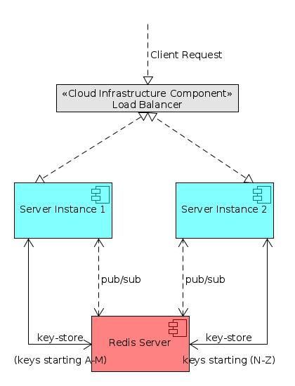

# nodejs_horizontal_scaling_using_redis
This provides skeletal code to partition resources between nodejs instances using redis store and pub/sub as a base.
If you find this code useful, as I am hoping it will, kindly click the star icon above to star this project. You are free to use this code in your projects. Please see the LICENSE file

## Overview
Many a time, smooth horizontal scaling of a server process gets hindered by the fact that resources that the server deals with need to be protected from race and other concurrency induced conditions when there are more than one instances of the server accessing and modifying the resource in a store without any kind of synchronization. Synchronization not done properly is itself an invitation to other problems like deadlocks. In any case synchronization slows down things. Fortunately, application domains often lend themselves to allowing a neat partition of their in-store resources between instances, such that it can permit a resource to be 'reserved' for or 'owned' by an instance to the extent that any database write operations and any heavy processing related to that resource are conducted by that instance alone. An example that jumps at us is Stock symbol feed processing, where we have to per force partition stock symbols between instances; otherwise the processing load for all the stocks, given the rate of ticks received from the Stock exchange can overwhelm a single server instance.

## The system we are talking about

The above figure shows two Node/Express server instances that receive client requests via a typical Cloud Load balancer. Suppose the request is routed to Instance 1 and the request pertains to resource R. The server 1 first tries to reserve the resource using the reserve method on the the RedisConnector object it is using to access the Redis server. Suppose the reserve is successful, then Server 1 now owns the resource (or owned it already) and can start to process it. Otherwise, it publishes a message by calling the sendMessage method on the redisConnect module and sends the necessary information alongwith the target server instance id of the instance which currently owns the resource. The other server instances (instance 2 only in this case) receive the message since they are already subscribed. But instances which are other than the targeted instance will skip processing it since there are checks. All this remote processing is abstracted away in functions exported from a file called remoteProcessing.js. The file routers.js demonstrates the use of this code by creating an express server and by defining some sample routes. One of the routes in this file (/save_resource) has been fleshed out to serve as an example of the remote processing based on reserving a resource, that we earlier described. Also see the testInfra function which is used by a unit test. The RedisConnector class is defined in redisConnect.js. The same file also exports the functions for creating a RedisConnector object (connect), set the instance id of the server (setInstance), send a message to another server instance (sendMessage), register a handler to be called on receipt of a message (onMessage), broadcast a message meant for all server instances (broadcast) and register a handler to be called on receipt of a broadcast (onBroadcastMessage). Note that sendMessage will send the ids of the sending and targeted server instances in the object that is sent in the message, while broadcast sends only the id of the source instance.

Also note that the example code assumes that locks (reservation information) are stored within redis but leaves open where the actual resources are stored. They could well be stored in a different database, may be an RDBMS, although commented code snippets for CRUD operations on the resource that have been inserted into the redisConnector.js file, assume redis storage.
